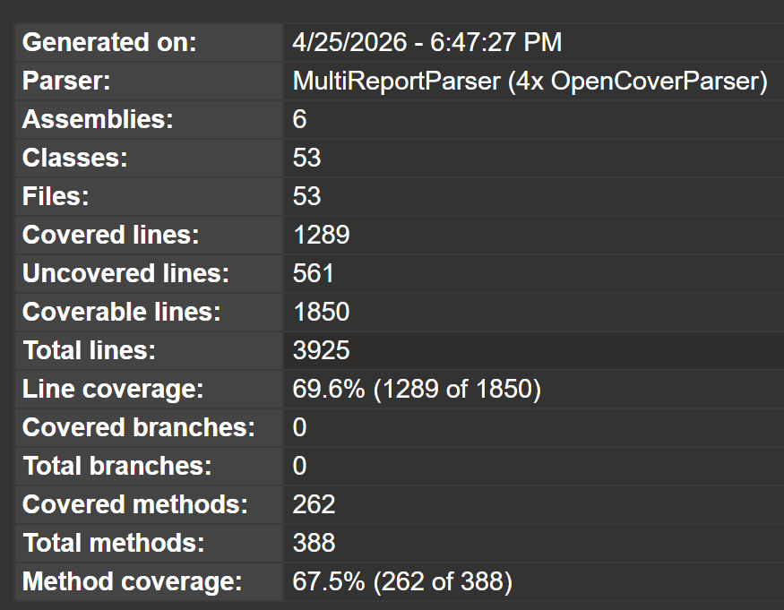

# Tichu

## Patterns Used: 

### Faactory:
Used to create combination objects given a list of cards. The factory figures out what combination they form and returns the correct subclass. Without it, every place that needed to validate and create a validation would have to contain the validation logic. We also use it to create round states. 

### Observer/Event Bus: 
Decouples the core game logic from Unity. Without it, each state would need to know about Unity UI to tell it a card was played or any action.  With the event bus, states just need to announce what happens, Unity subscribers, and reacts. The core game logic has no idea Unity exists. 

### State: 
Used to transition between game rounds. Without it, round would have one massive method to handle every phase. With the state pattern, each phase is a self-contained class with its own logic. 

### Singleton: 
 Ensures there is only ever one game instance running at a time in the Unity bridge. This ensures there is a single source of truth for the entire game session. Without it, you might have multiple places trying to manage game state. 

## Method Coverage

[Link to Coverage Details](MethodCoverage.htm)

## Game Overview
- **Players:** 4  
- **Teams:** 2 teams of 2 players (partners sit opposite each other)  
- **Type:** Trick-taking card game  
- **Goal:** First team to reach 1000 points  

---

## Deck Composition
- **Standard Cards (52)**  
  - Suits: Jade, Sword, Pagoda, Star  
  - Ranks: 2–10, J, Q, K, A  

- **Special Cards (4)**  
  - Mahjong  
  - Dog  
  - Phoenix  
  - Dragon  

---

## Setup Phase
1. Shuffle all 56 cards.  
2. Deal 8 cards to each player.  
3. **Grand Tichu Declaration:** Players may declare before seeing their remaining 6 cards.  
4. Deal the remaining 6 cards.  
5. **Tichu Declaration:** Players may declare anytime before playing their first card.  
6. **Card Exchange Phase:** Each player passes 3 cards:  
   - 1 to the left player  
   - 1 to their partner  
   - 1 to the right player  

---

## Game Flow Per Hand
1. Deal  
2. Declarations (Tichu / Grand Tichu)  
3. Card Exchange  
4. Trick Play  
5. Scoring  

---

## Trick Play Rules
- Player holding **Mahjong** must start the first trick.  

### Valid Play Types
- **Single:** Any single card  
- **Pair:** Two cards of the same rank  
- **Three of a Kind:** Three cards of the same rank  
- **Full House:** Three of a kind + a pair  
- **Straight:** At least 5 consecutive ranks  
- **Bomb:** Can be played out of turn; beats any non-bomb  
  - Types:  
    - Four of a Kind (four cards of the same rank)  
    - Straight Flush (5+ consecutive cards of the same suit)  

---

## Special Card Rules
- **Mahjong:**  
  - Rank 1  
  - Must start the first trick  
  - Can wish for a rank when played  
  - Wishes must be fulfilled when first possible  

- **Dog:**  
  - No trick value  
  - Passes lead to the partner  
  - Trick immediately ends  

- **Phoenix:**  
  - Wild card; can substitute in combinations  
  - As a single: value = 0.5 higher than the previous single  
  - When led, value acts as 0.5  
  - Cannot be used in bombs  

- **Dragon:**  
  - Highest single  
  - If you win a trick with the Dragon, you must give the trick to an opponent  

---

## Following Rules
- Players must follow the same combination type  
- Play higher than the previous play  
- Players may pass  
- After 3 consecutive passes, the trick ends  
- Last player to play wins the trick  

---

## Ending the Round
- Round ends when:  
  - One team gets both players out (**Double Victory**)  
  - Three players are out; the last player gives their cards and tricks to the opposing team  

---

## Scoring

### Card Values
| Card | Points |
|------|--------|
| 5    | 5      |
| 10   | 10     |
| K    | 10     |
| Dragon | 25   |
| Phoenix | -25 |
| Everything else | 0 |

- Team scores = sum of tricks won  

### Tichu / Grand Tichu
- **Tichu:**  
  - +100 if first out  
  - -100 if not first out  
- **Grand Tichu:**  
  - +200 if first out  
  - -200 if not first out  

### Double Victory
- Winning team scores 200 points  
- Opponents get 0 points  
